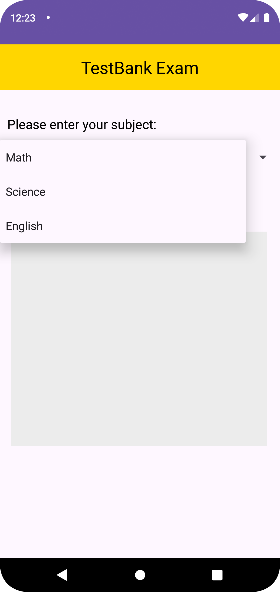

# TestBank Question v1 App

# Description:
The TestBank Question is an Android app allows users to select from various subjects (Math, Science, English) using a Spinner (dropdown menu).
Upon selecting a subject, the app displays corresponding test questions and answers.
Each subject has predefined test questions stored in separate classes (Test class for storing test details and Subject class for subject details).

# note: there is app_photo folder
